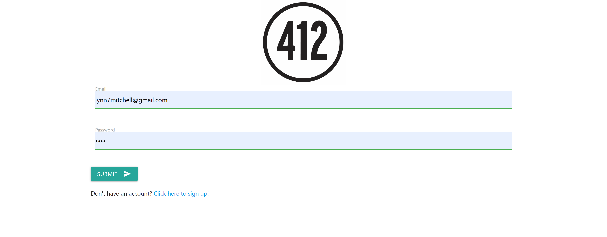
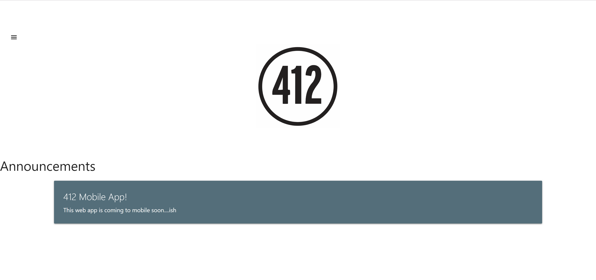
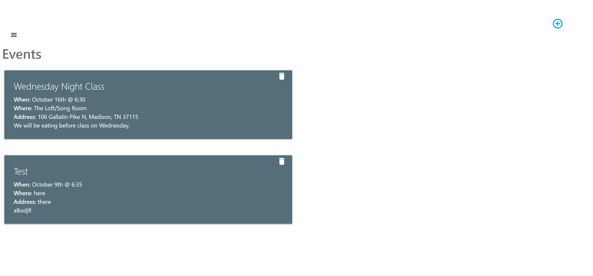
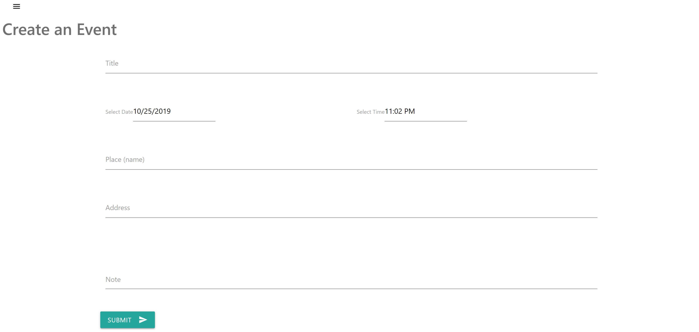

# Youthgroup App

Live Link: https://youthgroup.herokuapp.com/

# Purpose

This app was created to help youthgroups with keeping track of events. This app has an admin and student role so that the admin can add announcements. This will be updated with chat, albums, and payment for camps.

# Built Using

- HTML
- CSS
- Materialize CSS
- JavaScript
- React.js
- Node.js
- Express.js
- Mongo DB
- Mongoose ODM
- Axios
- React-router-dom
- Heroku

# Screenshots

## Login

## Home

## Events

## Event Form
